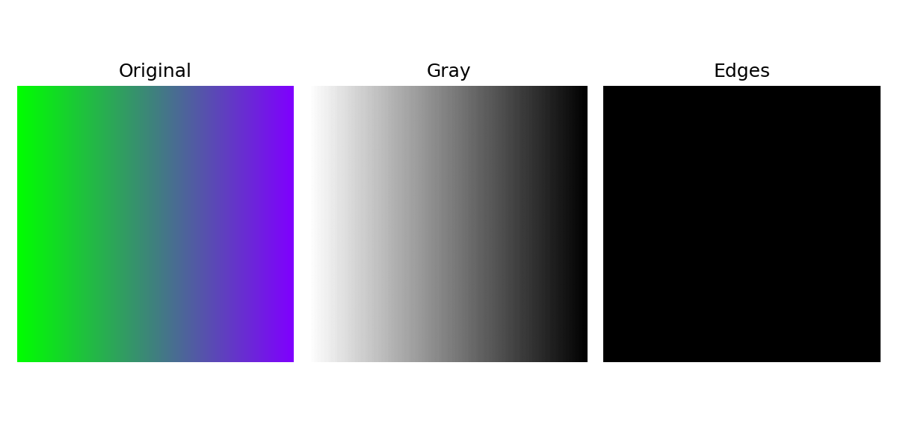

# Computer Vision Fundamentals with Python

Ringkasan singkat

Project ini dirancang sebagai repository edukatif untuk mahasiswa yang ingin belajar dasar-dasar Computer Vision dengan Python. Cocok untuk portofolio: rapi, mudah dibaca, dan berisi contoh hasil serta penjelasan singkat.

## Daftar Isi

- Overview
- Contoh Hasil Image Processing
- Penjelasan Proses Singkat
- Snippet Kode
- Insight Pembelajaran
- Future Improvements

## Overview

- Tujuan: belajar representasi citra, preprocessing, dan deteksi tepi dasar.
- Teknologi: Python 3.8+, OpenCV, NumPy, Matplotlib.
- Struktur: lihat folder `images/`, `results/`, `src/`, `docs/`.

---

## Contoh Hasil Image Processing

Berikut contoh hasil yang dihasilkan oleh pipeline sederhana pada folder `results/`.

### Original Image


### Grayscale Image


### Edge Detection


### Comparison Result



Gambar di atas akan tampil otomatis ketika repository dibuka di GitHub jika file berada pada path `results/`.

---

## Penjelasan Singkat Setiap Proses

- **Preprocessing Citra**: tahap awal untuk meningkatkan kualitas input—mis. resize, konversi warna, smoothing/blur untuk mengurangi noise. Preprocessing membantu algoritma selanjutnya bekerja lebih stabil.
- **Grayscale**: mengubah citra RGB menjadi skala abu-abu, mereduksi kompleksitas (dari 3 channel ke 1) dan seringkali diperlukan sebelum analisis seperti edge detection.
- **Edge Detection (Canny)**: metode untuk menemukan kontur/tepi objek pada citra. Canny melakukan smoothing, gradient detection, non-maximum suppression, dan hysteresis thresholding untuk hasil yang bersih.

---

## Snippet Kode Sederhana (OpenCV)

Contoh kode singkat untuk memuat gambar, mengonversi ke grayscale, dan menerapkan deteksi tepi Canny.

```python
import cv2

# Baca gambar (pastikan path relatif ke root repo atau file ini)
img = cv2.imread('results/original.png')

# Konversi ke grayscale
gray = cv2.cvtColor(img, cv2.COLOR_BGR2GRAY)

# Deteksi tepi menggunakan Canny
edges = cv2.Canny(gray, 50, 150)

# Simpan hasil
cv2.imwrite('results/gray.png', gray)
cv2.imwrite('results/edges.png', edges)

print('Selesai: hasil disimpan di folder results/')
```

Catatan singkat:

- `cv2.imread`: membaca file gambar ke array NumPy.
- `cv2.cvtColor`: mengubah ruang warna, mis. BGR -> GRAY.
- `cv2.Canny`: deteksi tepi; parameter pertama/dua biasanya threshold low/high.

---

## Insight Pembelajaran

- Mengonversi gambar ke grayscale menyederhanakan perhitungan dan sering mempercepat pipeline.
- Preprocessing (mis. blur) membantu mengurangi false edges akibat noise.
- Pemilihan threshold pada `Canny` sangat memengaruhi hasil; eksperimen dengan nilai berbeda diperlukan.

---

## Future Improvements

- Tambahkan contoh preprocessing lanjutan: Gaussian blur, histogram equalization.
- Tambahkan interactive notebook (`notebooks/`) yang menjelaskan parameter dan visualisasi langkah demi langkah.
- Implementasikan dan bandingkan beberapa metode deteksi tepi dan thresholding.
- Tambahkan unit tests kecil untuk memastikan konsistensi output pada contoh gambar.

---

Jika ingin, saya dapat menjalankan pemeriksaan cepat untuk memastikan semua gambar di `results/` valid dan menampilkan preview di README. Setelah itu saya bisa commit perubahan jika Anda mau.
